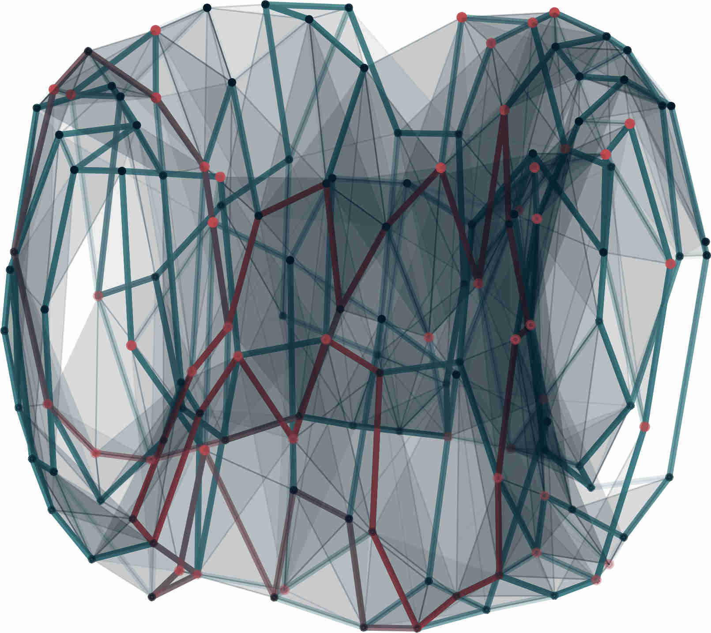

# PerMaViss 

**Per**sistence **Ma**yer **Vi**etoris **s**pectral **s**equence

This is a Python3 implementation of the Persistence Mayer Vietoris spectral sequence. 
For a mathematical description of the procedure, see "Distributing Persistent Homology via Spectral Sequences" 
on https://arxiv.org/abs/1907.05228

# DISCLAIMER

**The main purpose of this library is to explore how the Persistent Mayer Vietoris spectral sequence can be used for computing persistent homology.**

**This does not pretend to be an optimal library. Also, it does not parallelize the computations of persistent homology after the first page. Thus, this is slower than most other persistent homology computations.**

**This library is still on development and is still highly undertested. If you notice any issues, please email
TorrasCasasA@cardiff.ac.uk**

## Install

### Dependencies

PerMaViss requires:

- Python3
- Numpy

Optional for visualization:

- Matplotlib
- mpl_toolkits

### Installation

Clone to working directory and import

### Disclaimer

Standard MIT disclaimer `DISCLAIMER.txt`

### How to cite

Citation to this directory
