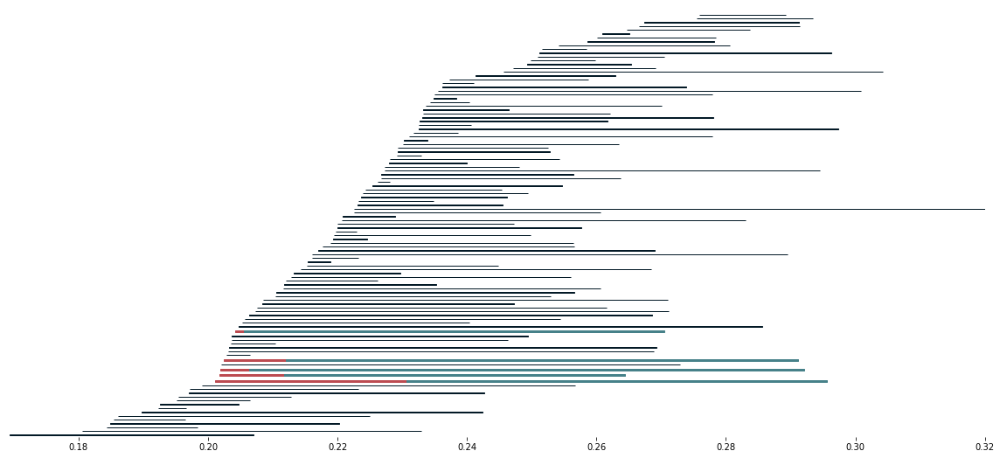

PerMaViss 0.0.1
***************

Welcome to PerMaViss 0.0.1! This is a Python3 implementation of the Persistence Mayer Vietoris spectral sequence. 
For a mathematical description of the procedure, see `Distributing Persistent Homology via Spectral Sequences <https://arxiv.org/abs/1907.05228>`_. 

In a nutshell, this library is intended to be a `proof of concept` for persistence homology parallelization. That is, one can divide a point cloud into covering regions, compute persistent homology on each part, and combine all results to obtain the global persistent homology again. This is done by means of the Persistence Mayer Vietoris spectral sequence. Here we present two examples, the torus and random point clouds in three dimensions. Both of these are divided into `8` mutually overlapping regions, and the spectral sequence is computed with respect to this cover. The resulting barcodes coincide with that which would be obtained by computing persistent homology directly.

This implementation is more of a `prototype` than a finished program. As such, it still needs to be optimized. Also, it would be great to have more examples for different covers. Additionally, it would be interesting to also have an implementation for cubical, alpha, and other complexes. Any collaboration or suggestion will be welcome!

   

Dependencies
============

PerMaViss requires:

- Python3
- NumPy
- Scipy
- Math

Optional for examples and notebooks:

- Matplotlib
- mpl_toolkits

Installation
============

Permaviss is built on Python 3, and relies only on `NumPy <http://www.numpy.org/>`_, `Math <https://docs.python.org/2/library/math.html>`_ and `Scipy <https://www.scipy.org/>`_. 
Additionally, Matplotlib and mpl_toolkits are used for the tutorials. 

To install, clone from GitHub repository and install::

    $ git clone https://github.com/atorras1618/PerMaViss
    $ cd PerMaViss
    $ pip3 install -e .

Quickstart
==========

The main function which we use is `permaviss.spectral_sequence.MV_spectral_seq.create_MV_ss`.
We start by taking 100 points in a noisy circle of radius 1

    >>> from permaviss.sample_point_clouds.examples import random_circle
    >>> point_cloud = random_circle(100, 1, epsilon=0.2)

Now we set the parameters for spectral sequence. These are

- a prime number `p`,

- the maximum dimension of the Rips Complex `max_dim`,

- the maximum radius of filtration `max_r`,

- the number of divisions `max_div` along the maximum range in `point_cloud`,

- and the `overlap` between different covering regions.

In our case, we set the parameters to cover our circle with 9 covering regions.
Notice that  in order for the algorithm to give the correct result we need `overlap > max_r`.

    >>> p = 3
    >>> max_dim = 3
    >>> max_r = 0.2
    >>> max_div = 3
    >>> overlap = max_r * 1.01

Then, we compute the spectral sequence, notice that the method prints the successive page ranks.

    >>> from permaviss.spectral_sequence.MV_spectral_seq import create_MV_ss
    >>> MV_ss = create_MV_ss(point_cloud, max_r, max_dim, max_div, overlap, p)
    PAGE: 1
    [[  0   0   0   0   0]
     [  7   0   0   0   0]
     [133  33   0   0   0]]
    PAGE: 2
    [[  0   0   0   0   0]
     [  7   0   0   0   0]
     [100   0   0   0   0]]
    PAGE: 3
    [[  0   0   0   0   0]
     [  7   0   0   0   0]
     [100   0   0   0   0]]
    PAGE: 4
    [[  0   0   0   0   0]
     [  7   0   0   0   0]
     [100   0   0   0   0]]

We can inspect the obtained barcodes on the 1st dimension.

    >>> MV_ss.persistent_homology[1].barcode
    array([[ 0.08218822,  0.09287436],
           [ 0.0874977 ,  0.11781674],
           [ 0.10459203,  0.12520266],
           [ 0.14999507,  0.18220508],
           [ 0.15036084,  0.15760192],
           [ 0.16260913,  0.1695936 ],
           [ 0.16462541,  0.16942819]])

Notice that in this case, there was no need to solve the extension problem. See the examples folder for nontrivial extensions.

DISCLAIMER
==========

**The main purpose of this library is to explore how the Persistent Mayer Vietoris spectral sequence can be used for computing persistent homology.**

**This does not pretend to be an optimal library. Also, it does not parallelize the computations of persistent homology after the first page. Thus, this is slower than most other persistent homology computations.**

**This library is still on development and is still highly undertested. If you notice any issues, please email
atorras1618@gmail.com**

**This library is published under the standard MIT licence. Thus:
THE SOFTWARE IS PROVIDED "AS IS", WITHOUT WARRANTY OF ANY KIND, EXPRESS OR
IMPLIED, INCLUDING BUT NOT LIMITED TO THE WARRANTIES OF MERCHANTABILITY,
FITNESS FOR A PARTICULAR PURPOSE AND NONINFRINGEMENT. IN NO EVENT SHALL THE
AUTHORS OR COPYRIGHT HOLDERS BE LIABLE FOR ANY CLAIM, DAMAGES OR OTHER
LIABILITY, WHETHER IN AN ACTION OF CONTRACT, TORT OR OTHERWISE, ARISING FROM,
OUT OF OR IN CONNECTION WITH THE SOFTWARE OR THE USE OR OTHER DEALINGS IN THE
SOFTWARE.**

Reference
=========

This module is written using the algorithm in `Distributing Persistent Homology via Spectral Sequences <https://arxiv.org/abs/1907.05228>`_.

