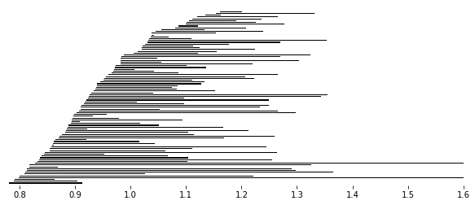
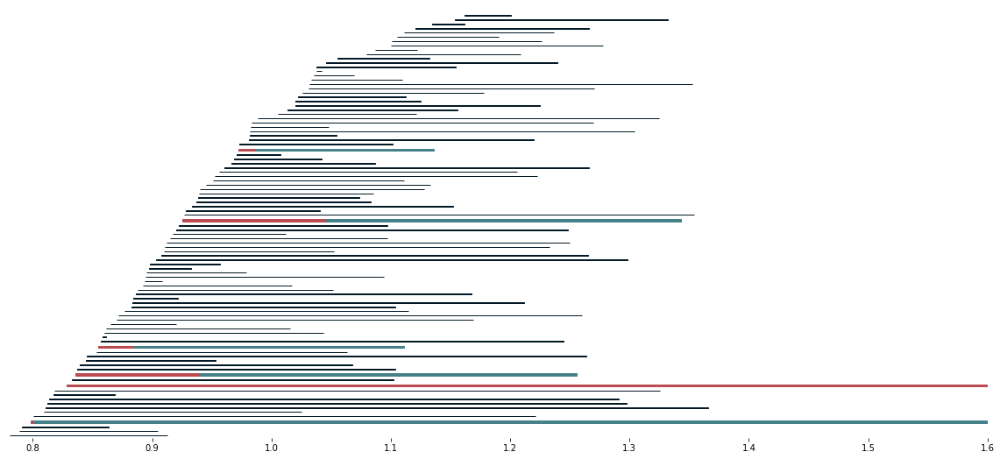
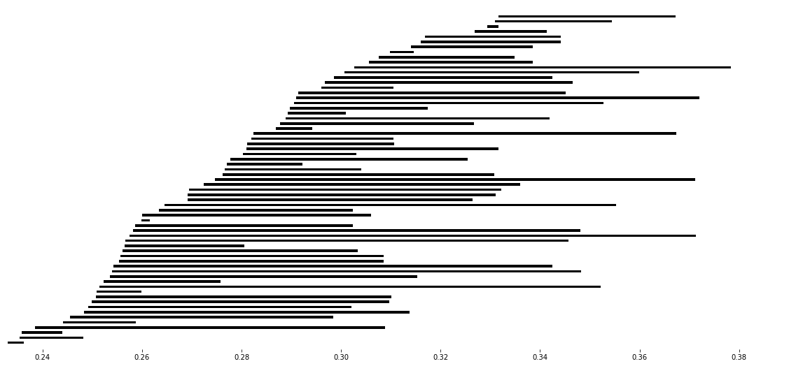
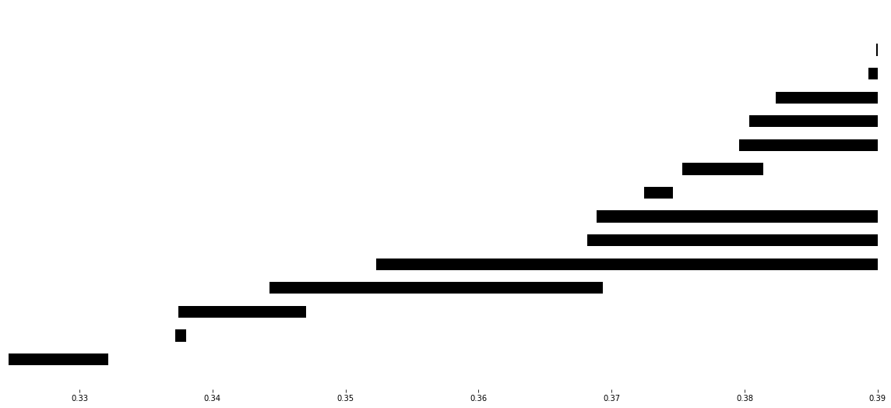

Usage and examples
==================

In these tutorials we will see how data can be broken down into pieces and persistent homology can still be computed through the Mayer-Vietoris procedure. 
Check the `notebooks <https://github.com/atorras1618/PerMaViss/tree/master/examples>`_ if you prefer to work through these.

Torus
-----

We compute persistent homology through two methods. First we compute persistent homology using the standard method. Then we compute this again using the Persistence Mayer Vietoris spectral sequence. At the end we compare both results and confirm that they coincide. 

First we do all the relevant imports for this example

    >>> import scipy.spatial.distance as dist
    >>> from permaviss.sample_point_clouds.examples import torus3D, take_sample
    >>> from permaviss.simplicial_complexes.vietoris_rips import vietoris_rips
    >>> from permaviss.simplicial_complexes.differentials import complex_differentials
    >>> from permaviss.spectral_sequence.MV_spectral_seq import create_MV_ss

We start by taking a sample of 1300 points from a torus of section radius 1 and radius from center to section center 3. Since this sample is too big, we take a subsample of 150 points by using a minmax method. We store it in `point_cloud`.

    >>> X = torus_3D(1300,3)
    >>> point_cloud = take_sample(X,150)

Next we compute the distance matrix of `point_cloud`. Also we compute the Vietoris Rips complex of `point_cloud`
up to a maximum dimension `3` and maximum filtration radius `1.6`. 

    >>> Dist = dist.squareform(dist.pdist(point_cloud))
    >>> max_r = 1.6
    >>> max_dim = 3
    >>> C, R = vietoris_rips(Dist, max_r, max_dim)

Afterwards, we compute the complex differentials using arithmetic mod `p`, a prime number.
Then we get the persistent homology of `point_cloud` with the specified parameters. We store the result in `PerHom`. Additionally, we inspect the second persistent homology group barcodes (notice that these might be empty).

    >>> p = 5
    >>> Diff = complex_differentials(C, p)
    >>> PerHom, _, _ = persistent_homology(Diff, R, max_r, p)
    >>> print(PerHom[2].barcode)    
    [[ 1.36770353  1.38090695]
     [ 1.51515438  1.6       ]]

Now we will proceed to compute again persistent homology of `point_cloud` using the Persistence Mayer-Vietoris spectral sequence instead. For this task we take the same parameters `max_r`, `max_dim` and `p` as before. We set `max_div`, which is the number of divisions along the coordinate with greater range in `point_cloud`, to be 2. This will indicate **create_MV_ss** to cover `point_cloud` by 8 hypercubes. Also, we set the `overlap` between neighbouring regions to be slightly greater than `max_r`. The method **create_MV_ss** prints the ranks of the computed pages and returns a spectral sequence object which we store in `MV_ss`.

    >>> max_div = 2
    >>> overlap = max_r*1.01
    >>> MV_ss = create_MV_ss(point_cloud, max_r, max_dim, max_div, overlap, p)
    PAGE: 1
    [[  1   0   0   0   0   0   0   0   0]
     [ 98  14   0   0   0   0   0   0   0]
     [217  56   0   0   0   0   0   0   0]]
    PAGE: 2
    [[  1   0   0   0   0   0   0   0   0]
     [ 84   1   0   0   0   0   0   0   0]
     [161   5   0   0   0   0   0   0   0]]
    PAGE: 3
    [[  1   0   0   0   0   0   0   0   0]
     [ 84   1   0   0   0   0   0   0   0]
     [161   5   0   0   0   0   0   0   0]]
    PAGE: 4
    [[  1   0   0   0   0   0   0   0   0]
     [ 84   1   0   0   0   0   0   0   0]
     [161   5   0   0   0   0   0   0   0]]

Now, we compare the computed persistent homology barcodes by both methods. Unless an `AssertError` comes up, this means that the computed barcodes **coincide**. Also, we plot the relevant barcodes. 

    >>> for it, PH in enumerate(MV_ss.persistent_homology):
    >>>     # Check that computed barcodes coincide
    >>>     assert np.array_equal(PH.barcode, PerHom[it].barcode)
    >>>     # Set plotting parameters
    >>>     min_r = min(PH.barcode[:,0])
    >>>     step = max_r/PH.dim
    >>>     width = step / 2.
    >>>     fig, ax = plt.subplots(figsize = (10,4))
    >>>     ax = plt.axes(frameon=False)
    >>>     y_coord = 0
    >>>     # Plot barcodes
    >>>     for k, b in enumerate(PH.barcode):
    >>>         ax.fill([b[0],b[1],b[1],b[0]],[y_coord,y_coord,y_coord+width,y_coord+width],'black',label='H0')
    >>>         y_coord += step
    >>>   
    >>> 
    >>>     # Show figure 
    >>>     ax.axes.get_yaxis().set_visible(False)
    >>>     ax.set_xlim([min_r,max_r])
    >>>     ax.set_ylim([-step, max_r + step])
    >>>     plt.savefig("barcode_r{}.png".format(it))
    >>>     plt.show()

Here we look at the extension information on one dimensional persistence classes. For this we exploit the extra information stored in `MV_ss`. What we do is plot the one dimensional barcodes, highlighting those bars from the ``(0,1)`` position in the infinity page in red. Also, we highlight in blue when these bars are extended by a bar in the ``(1,0)`` position on the infinity page. All the black bars are only comming from classes in the ``(1,0)`` position on the infinity page.  

    >>> PH = MV_ss.persistent_homology
    >>> start_rad = min(PH[1].barcode[:,0])
    >>> end_rad = max(PH[1].barcode[:,1])
    >>> persistence = end_rad - start_rad
    >>> fig, ax = plt.subplots(figsize = (20,9))
    >>> ax = plt.axes(frameon=False)
    >>> # ax = plt.axes()
    >>> step = (persistence /2) / PH[1].dim
    >>> width = (step/6.)
    >>> y_coord = 0
    >>> for b in PH[1].barcode:
    >>>     if b[0] not in MV_ss.Hom[2][1][0].barcode[:,0]:
    >>>         ax.fill([b[0],b[1],b[1],b[0]],[y_coord,y_coord,y_coord+width,y_coord+width],c="#031926", edgecolor='none')
    >>>     else:
    >>>         index = np.argmax(b[0] <= MV_ss.Hom[2][1][0].barcode[:,0])
    >>>         midpoint = MV_ss.Hom[2][1][0].barcode[index,1]
    >>>         ax.fill([b[0], midpoint, midpoint, b[0]],[y_coord,y_coord,y_coord+step,y_coord+step],c="#bc4b51", edgecolor='none')
    >>>         ax.fill([midpoint, b[1], b[1], midpoint],[y_coord,y_coord,y_coord+step,y_coord+step],c='#468189', edgecolor='none')
    >>>         y_coord = y_coord + step
    >>> 
    >>>     y_coord += 2 * step 
    >>> 
    >>> # Show figure
    >>> ax.axes.get_yaxis().set_visible(False)
    >>> ax.set_xlim([start_rad,end_rad])
    >>> ax.set_ylim([-step, y_coord + step])
    >>> plt.show()

Random 3D point cloud
---------------------

We can repeat the same procedure as with the torus, but with random 3D point clouds. 
First we do all the relevant imports for this example

    >>> import scipy.spatial.distance as dist
    >>> from permaviss.sample_point_clouds.examples import random_cube, take_sample
    >>> from permaviss.simplicial_complexes.vietoris_rips import vietoris_rips
    >>> from permaviss.simplicial_complexes.differentials import complex_differentials
    >>> from permaviss.spectral_sequence.MV_spectral_seq import create_MV_ss

We start by taking a sample of 1300 points from a torus of section radius 1 and radius from center to section center 3. Since this sample is too big, we take a subsample of 150 points by using a minmax method. We store it in `point_cloud`.

    >>> X = random_cube(1300,3)
    >>> point_cloud = take_sample(X,150)

Next we compute the distance matrix of `point_cloud`. Also we compute the Vietoris Rips complex of `point_cloud`
up to a maximum dimension `3` and maximum filtration radius `1.6`. 

    >>> Dist = dist.squareform(dist.pdist(point_cloud))
    >>> max_r = 1.6
    >>> max_dim = 3
    >>> C, R = vietoris_rips(Dist, max_r, max_dim)

Afterwards, we compute the complex differentials using arithmetic mod `p`, a prime number.
Then we get the persistent homology of `point_cloud` with the specified parameters. We store the result in `PerHom`. 

    >>> p = 5
    >>> Diff = complex_differentials(C, p)
    >>> PerHom, _, _ = persistent_homology(Diff, R, max_r, p)

Now we will proceed to compute again persistent homology of `point_cloud` using the Persistence Mayer-Vietoris spectral sequence instead. For this task we take the same parameters `max_r`, `max_dim` and `p` as before. We set `max_div`, which is the number of divisions along the coordinate with greater range in `point_cloud`, to be 2. This will indicate **create_MV_ss** to cover `point_cloud` by 8 hypercubes. Also, we set the `overlap` between neighbouring regions to be slightly greater than `max_r`. The method **create_MV_ss** prints the ranks of the computed pages and returns a spectral sequence object which we store in `MV_ss`.

    >>> max_div = 2
    >>> overlap = max_r*1.01
    >>> MV_ss = create_MV_ss(point_cloud, max_r, max_dim, max_div, overlap, p)
    PAGE: 1
    [[ 20   0   0   0   0   0   0   0   0]
     [163  72  24   6   0   0   0   0   0]
     [325 351 376 374 280 140  40   5   0]]
    PAGE: 2
    [[ 20   0   0   0   0   0   0   0   0]
     [110   1   0   0   0   0   0   0   0]
     [151   5   1   0   0   0   0   0   0]]
    PAGE: 3
    [[ 20   0   0   0   0   0   0   0   0]
     [109   1   0   0   0   0   0   0   0]
     [151   5   0   0   0   0   0   0   0]]
    PAGE: 4
    [[ 20   0   0   0   0   0   0   0   0]
     [109   1   0   0   0   0   0   0   0]
     [151   5   0   0   0   0   0   0   0]]

Now, we compare the computed persistent homology barcodes by both methods. Unless an `AssertError` comes up, this means that the computed barcodes **coincide**. Also, we plot the relevant barcodes. 

    >>> for it, PH in enumerate(MV_ss.persistent_homology):
    >>>     # Check that computed barcodes coincide
    >>>     assert np.array_equal(PH.barcode, PerHom[it].barcode)
    >>>     # Set plotting parameters
    >>>     min_r = min(PH.barcode[:,0])
    >>>     step = max_r/PH.dim
    >>>     width = step / 2.
    >>>     fig, ax = plt.subplots(figsize = (10,4))
    >>>     ax = plt.axes(frameon=False)
    >>>     y_coord = 0
    >>>     # Plot barcodes
    >>>     for k, b in enumerate(PH.barcode):
    >>>         ax.fill([b[0],b[1],b[1],b[0]],[y_coord,y_coord,y_coord+width,y_coord+width],'black',label='H0')
    >>>         y_coord += step
    >>>   
    >>> 
    >>>     # Show figure 
    >>>     ax.axes.get_yaxis().set_visible(False)
    >>>     ax.set_xlim([min_r,max_r])
    >>>     ax.set_ylim([-step, max_r + step])
    >>>     plt.savefig("barcode_r{}.png".format(it))
    >>>     plt.show()

Here we look at the extension information on one dimensional persistence classes. For this we exploit the extra information stored in `MV_ss`. What we do is plot the one dimensional barcodes, highlighting those bars from the ``(0,1)`` position in the infinity page in red. Also, we highlight in blue when these bars are extended by a bar in the ``(1,0)`` position on the infinity page. All the black bars are only comming from classes in the ``(1,0)`` position on the infinity page.  

    >>> PH = MV_ss.persistent_homology
    >>> start_rad = min(PH[1].barcode[:,0])
    >>> end_rad = max(PH[1].barcode[:,1])
    >>> persistence = end_rad - start_rad
    >>> fig, ax = plt.subplots(figsize = (20,9))
    >>> ax = plt.axes(frameon=False)
    >>> # ax = plt.axes()
    >>> step = (persistence /2) / PH[1].dim
    >>> width = (step/6.)
    >>> y_coord = 0
    >>> for b in PH[1].barcode:
    >>>     if b[0] not in MV_ss.Hom[2][1][0].barcode[:,0]:
    >>>         ax.fill([b[0],b[1],b[1],b[0]],[y_coord,y_coord,y_coord+width,y_coord+width],c="#031926", edgecolor='none')
    >>>     else:
    >>>         index = np.argmax(b[0] <= MV_ss.Hom[2][1][0].barcode[:,0])
    >>>         midpoint = MV_ss.Hom[2][1][0].barcode[index,1]
    >>>         ax.fill([b[0], midpoint, midpoint, b[0]],[y_coord,y_coord,y_coord+step,y_coord+step],c="#bc4b51", edgecolor='none')
    >>>         ax.fill([midpoint, b[1], b[1], midpoint],[y_coord,y_coord,y_coord+step,y_coord+step],c='#468189', edgecolor='none')
    >>>         y_coord = y_coord + step
    >>> 
    >>>     y_coord += 2 * step 
    >>> 
    >>> # Show figure
    >>> ax.axes.get_yaxis().set_visible(False)
    >>> ax.set_xlim([start_rad,end_rad])
    >>> ax.set_ylim([-step, y_coord + step])
    >>> plt.show()

.. image:: 3Dextension.png
   :width: 500

