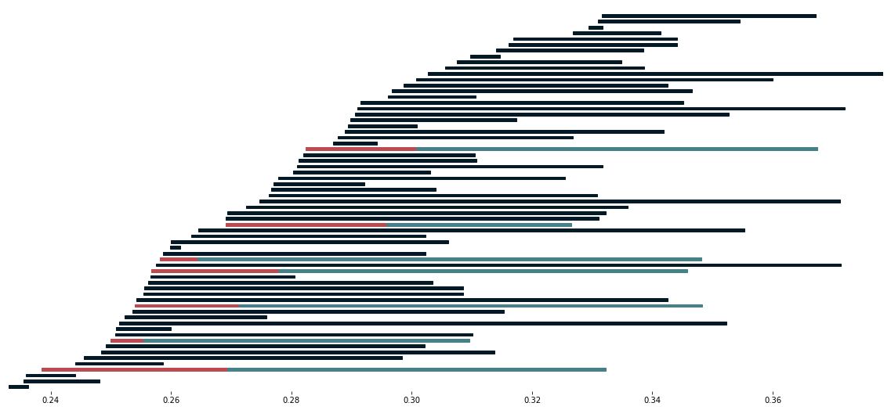

.. PerMaViss documentation master file, created by
   sphinx-quickstart on Tue Jan  7 17:02:56 2020.
   You can adapt this file completely to your liking, but it should at least
   contain the root `toctree` directive.

Welcome to PerMaViss 0.0.1 documentation!
=========================================

Welcome to PerMaViss 0.0.1! This is a Python3 implementation of the Persistence Mayer Vietoris spectral sequence. 
For a mathematical description of the procedure, see `Distributing Persistent Homology via Spectral Sequences <https://arxiv.org/abs/1907.05228>`_.

In a nutshell, this library is intended to be a `proof of concept` for persistence homology parallelization. That is, one can divide a point cloud into covering regions, compute persistent homology on each part, and combine all results to obtain the global persistent homology again. This is done by means of the Persistence Mayer Vietoris spectral sequence. Here we present two examples, the torus and random point clouds in three dimensions. Both of these are divided into `8` mutually overlapping regions, and the spectral sequence is computed with respect to this cover. The resulting barcodes coincide with that which would be obtained by computing persistent homology directly.

This implementation is more of a `prototype` than a finished program. As such, it still needs to be optimized. Even there might be some bugs, since there are still not enough tests for all the functionalities of the spectral sequence (if you detect any, please get in touch). 
Also, it would be great to have more examples for different covers. Additionally, it would be interesting to also have an implementation for cubical, alpha, and other complexes. Any collaboration or suggestion will be welcome!

.. toctree::
   :maxdepth: 3
   :caption: Contents

   about/index.rst
   install.rst
   examples/index.rst
   reference/index.rst

Indices and tables
==================

* :ref:`genindex`
* :ref:`modindex`
* :ref:`search`
